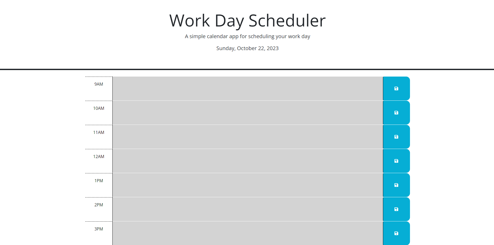

# Daily Planner

## Description

This repo contains the content for week 5

- I wanted to create a tool that can help a user plan out their day.
- The application can take a user's inputs for each hourly textbox, and save them so that when the page refreshes, the inputs are still there. Also, each hourly box is color coded for past, present, and future
- I learned more about about functions, and a lot about how to use JQuery and its respective commands.

## Installation

- Link to deployed website: https://luwylbab.github.io/Week-5-Challenge/

- Get SSH key from https://github.com/Luwylbab/Week-5-Challenge

- Clone the repository using [git clone git@github.com:Luwylbab/Week-5-Challenge.git]

## Usage

When a user opens the webpage, they will be greeted by the title of the page and the current date. Below that, there is a list of the hours within an average workday (9AM-5PM), which are color coded using grey for hours that have already past, green for the current hour, and red for hours that are in the future. Each hour has a designated textbox, that the user is free to type whatever they please into. Once a user has filled out their textbox, they can hit the save button, located to the right of the desired textbox, and save the text input into the local storage. This allows the user's todo list to remain intact, regardless if the page is refreshed.

 

## Credits

Starter Code: 
https://github.com/coding-boot-camp/crispy-octo-meme

Used Xpert Learning Assistant to help with writing functions and debugging code: 
https://bootcampspot.instructure.com/courses/4612/external_tools/313

Tutoring assistance with JQuery from Andrew Hardemon